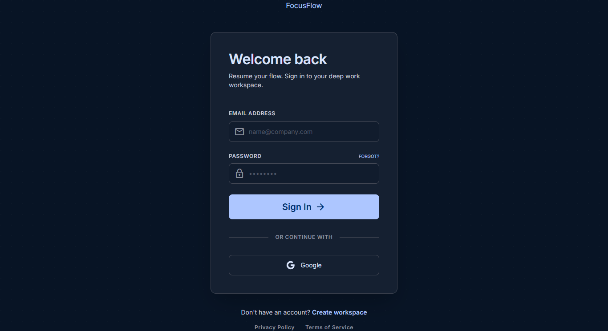
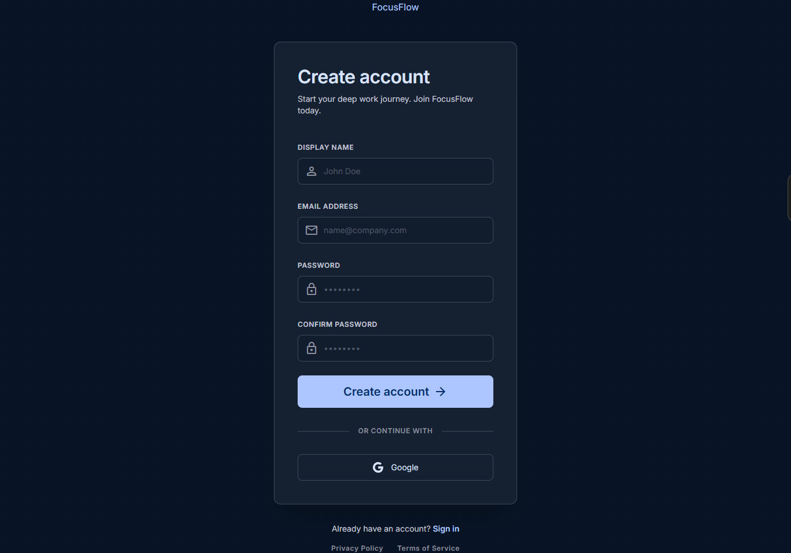
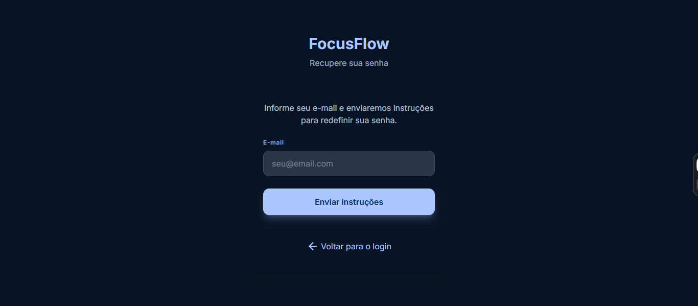

# 🎯 FocusFlow — Pomodoro Study Timer

> Aplicação web fullstack para organização de estudo com timer Pomodoro, autenticação híbrida, gestão de tarefas e dashboard de produtividade. O projeto está em evolução, com foco em portfólio, arquitetura limpa e boas práticas de desenvolvimento.

O FocusFlow nasceu para unir foco, acompanhamento e análise de desempenho em uma experiência simples e visualmente objetiva. Ao longo do desenvolvimento, a aplicação passou a contar com fluxos de autenticação, timer de sessão, tarefas de estudo, histórico de sessões e uma estrutura monorepo organizada para frontend e backend.

---

## 📌 Visão geral do projeto

O projeto tem como objetivo ajudar o usuário a:

- estruturar sessões de estudo com a técnica Pomodoro;
- acompanhar a produtividade por meio de métricas e histórico;
- organizar tarefas em uma interface clara e responsiva;
- manter uma base sólida de arquitetura para evolução futura.

A documentação de regras de negócio para as telas principais está organizada em [docs/architecture](docs/architecture), e o repositório já acompanha uma estrutura modular para frontend, backend e testes.

---

## 🖥️ Screenshots do estado atual

Abaixo estão algumas capturas já registradas da interface atual do projeto:

1. Tela de login

2. Tela de cadastro

3. Tela de recuperação de senha


---

## ✨ Funcionalidades já implementadas ou em andamento

### Autenticação e conta

- fluxo de login, cadastro, recuperação e redefinição de senha;
- validação de formulários com Zod e React Hook Form;
- autenticação local com hash e sessão, além de integração com Firebase Authentication para login Google;
- estrutura preparada para upload e gestão de avatar com Cloudinary.

### Timer Pomodoro

- timer de foco com controle de início, pausa e continuação;
- ação de incremento de tempo (+5 minutos) quando o cronômetro está parado ou pausado;
- feedback visual e alertas ao fim da sessão;
- base para métricas de produtividade vinculadas ao histórico de sessões.

### Tarefas de estudo

- criação, edição, conclusão e organização de tarefas;
- prioridade e ordenação visual;
- integração com as métricas de sessão e daily goal.

### Analytics e histórico

- histórico de sessões e métricas de foco;
- indicadores como streak, focus score e horas de foco;
- painel com base para análise semanal e evolução do comportamento do usuário.

### Experiência de uso

- rotas públicas e privadas organizadas com Next.js App Router;
- navegação com layout mais próximo de uma aplicação real;
- componente de notificações e feedback de usuário com toasts.

---

## 🧰 Stack tecnológica

### Frontend (client)

- Next.js (App Router)
- React + TypeScript
- Tailwind CSS
- Zustand para estado local
- React Hook Form + Zod
- Axios
- Sonner para feedback visual

### Backend (server)

- Node.js + Express
- Bun como runtime de desenvolvimento
- Prisma ORM
- PostgreSQL
- Firebase Authentication
- Cloudinary para mídia
- Zod para validação

### Qualidade e testes

- Vitest
- Supertest
- Playwright
- MSW

---

## 🏗️ Arquitetura atual

O projeto segue uma arquitetura monolítica modular, separada em duas camadas principais:

```text
client/  → interface web com Next.js, rotas, componentes, hooks e stores
server/  → API REST com Express, controllers, services, middlewares e Prisma
```

Principais pontos da estrutura atual:

- frontend e backend desacoplados, com comunicação via API REST;
- organização por domínio no frontend, com pastas como auth, timer, tasks, analytics e shared;
- backend com camada de serviços para regras de negócio e Prisma para persistência;
- foco em escalabilidade e testabilidade para evolução futura.

---

## 📁 Estrutura do repositório

```text
focus-flow-project/
├── client/
│   ├── public/
│   │   └── screenshots/
│   ├── src/
│   │   ├── app/
│   │   ├── components/
│   │   ├── hooks/
│   │   ├── lib/
│   │   ├── schemas/
│   │   ├── stores/
│   │   └── types/
│   └── tests/
├── docs/
│   ├── architecture/
│   └── design/
├── server/
│   ├── prisma/
│   ├── src/
│   │   ├── config/
│   │   ├── controllers/
│   │   ├── middlewares/
│   │   ├── routes/
│   │   ├── services/
│   │   └── app.ts
│   └── tests/
└── README.md
```

---

## 🚀 Como rodar localmente

### Backend

```bash
cd server
bun install
bun dev
```

### Frontend

```bash
cd client
bun install
bun dev
```

> Em ambientes locais, é necessário configurar as variáveis de ambiente do backend e do frontend conforme as integrações com Firebase, Prisma e Cloudinary.

---

## 🧪 Testes

Os projetos já contam com estrutura inicial para testes:

```bash
cd client
bun test
```

```bash
cd server
bun test
```

---

## 🗺️ Roadmap atual

### Concluído / em evolução

- estrutura base do monorepo;
- autenticação inicial e validações;
- telas públicas e privadas organizadas;
- timer, tarefas e base de analytics;
- documentação visual e de regras de negócio.

### Próximos passos

- consolidar a integração completa entre timer, tarefas e métricas;
- finalizar o fluxo de avatar e persistência de dados do usuário;
- melhorar a experiência responsiva e a consistência visual;
- expandir cobertura de testes e preparar deploy.

---

## 📄 Licença

Este projeto está em desenvolvimento e pode ser utilizado como referência para estudos e portfólio.

---

## 👤 Autor

Desenvolvido por Wesley como parte do portfólio pessoal fullstack.
